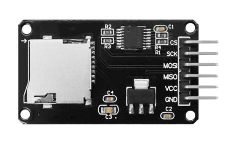
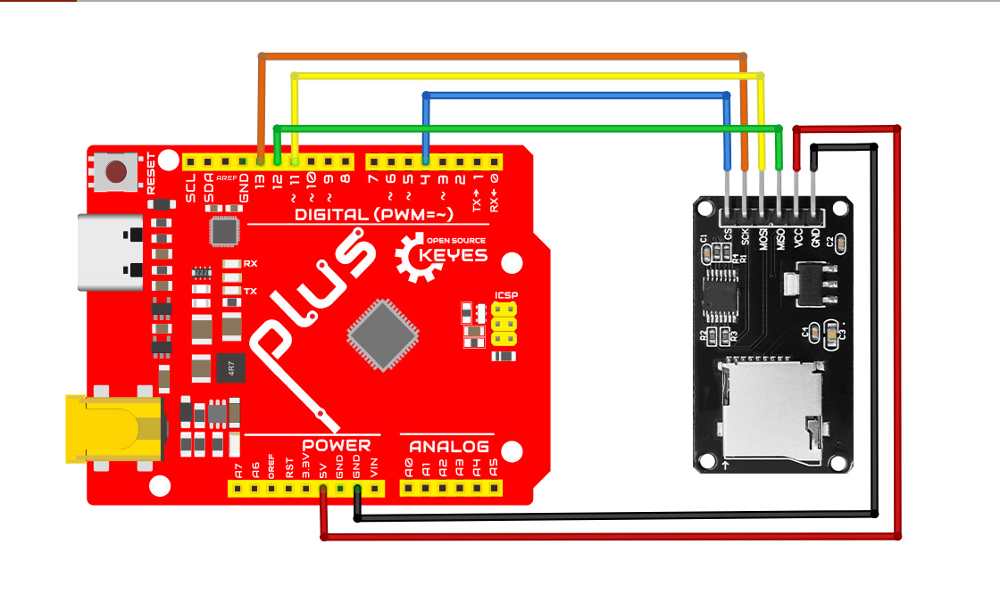

.. _Micro-SD卡读写模块:

Micro SD卡读写模块
==================

.. _1、概述:

1、概述
-------

Micro SD 卡读写模块多以小型电路板形式呈现，采用 SPI
接口通信，配备电平转换芯片可适配不同电平标准设备。它具备数据读写能力，能对
Micro SD
卡进行文件创建、读写、删除等操作，支持不同格式文件，且可兼容不同容量的
SD 卡。该模块广泛应用于数据记录、音频 /
视频存储、程序更新等场景，如在环境监测设备、音乐播放器、智能家电等设备中发挥作用。以
Arduino 开发板连接为例，通过硬件连接与相应软件编程即可实现对 SD
卡的读写操作。

.. _2、规格参数:

2、规格参数
-----------

| 工作电压：3.3v-5v
| 工作电流：
| 静态：1 - 10mA
| 读取：10 - 50mA
| 写入：20 - 100mA
| 通信方式：SPI通信
| 支持SD卡类型：Micro SD卡、Micro SDHC卡等
| 文件系统：支持 FAT16 和 FAT32
| 工作温度：-10℃-60℃
| 尺寸：46mm*24mm

.. _3、接线图:

3、接线图
---------

.. container:: table-wrapper

   ================== =====
   Micro SD卡读写模块 UNO板
   ================== =====
   CS                 4
   SCK                13
   MOSI               11
   MISO               12
   VCC                5V
   GND                GND
   ================== =====

.. _4、测试代码:

4、测试代码
-----------

::

   /*
     SD card basic file example

     This example shows how to create and destroy an SD card file
     The circuit:
      SD card attached to SPI bus as follows:
    ** MOSI - pin 11
    ** MISO - pin 12
    ** CLK - pin 13
    ** CS - pin 4 (for MKRZero SD: SDCARD_SS_PIN)

     created   Nov 2010
     by David A. Mellis
     modified 9 Apr 2012
     by Tom Igoe

     This example code is in the public domain.

   */
   #include <SPI.h>
   #include <SD.h>

   File myFile;

   void setup() {
     // Open serial communications and wait for port to open:
     Serial.begin(9600);
     while (!Serial) {
       ; // wait for serial port to connect. Needed for native USB port only
     }

     Serial.print("Initializing SD card...");

     if (!SD.begin(4)) {
       Serial.println("initialization failed!");
       while (1);
     }
     Serial.println("initialization done.");

     if (SD.exists("example.txt")) {
       Serial.println("example.txt exists.");
     } else {
       Serial.println("example.txt doesn't exist.");
     }

     // open a new file and immediately close it:
     Serial.println("Creating example.txt...");
     myFile = SD.open("example.txt", FILE_WRITE);
     myFile.close();

     // Check to see if the file exists:
     if (SD.exists("example.txt")) {
       Serial.println("example.txt exists.");
     } else {
       Serial.println("example.txt doesn't exist.");
     }

     // delete the file:
     Serial.println("Removing example.txt...");
     SD.remove("example.txt");

     if (SD.exists("example.txt")) {
       Serial.println("example.txt exists.");
     } else {
       Serial.println("example.txt doesn't exist.");
     }
   }

   void loop() {
     // nothing happens after setup finishes.
   }

.. _5、实验结果:

5、实验结果
-----------

烧录代码后会在插入的SD卡里先检查有没有文件，然后创建一个名为“EXAMPLE”txt文件，创建成功后再判断有没有这个文件，之后删掉这个txt文件.
